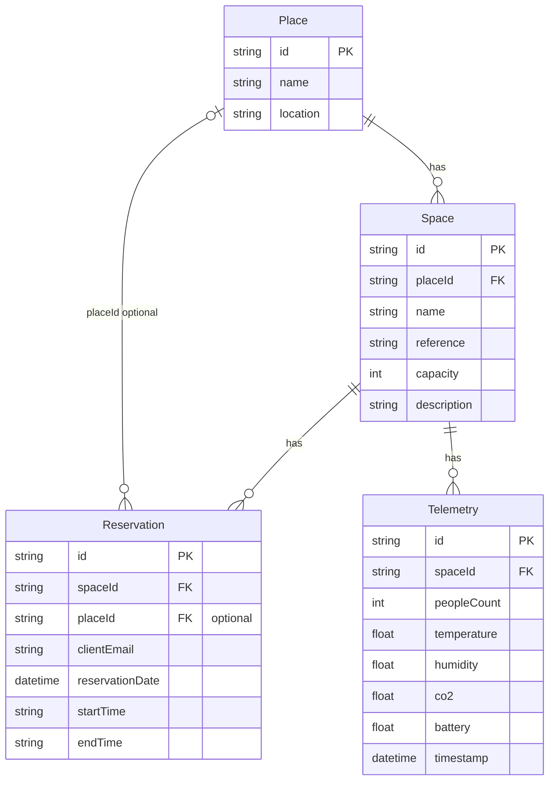

# Database schema

Database schema for SpaceFlow API: places, spaces, reservations, and telemetry.

## ER diagram

## Relationships

| From         | To           | Cardinality | Description                    |
|-------------|--------------|-------------|--------------------------------|
| Place       | Space        | 1 — N       | A place has many spaces        |
| Space       | Reservation  | 1 — N       | A space has many reservations  |
| Space       | Telemetry    | 1 — N       | A space has many IoT readings  |
| Reservation | Place (opt.) | N — 1       | placeId denormalized for filters |

## Tables and columns

| Table        | Column         | Type    | Notes                 |
|-------------|----------------|---------|------------------------|
| Place       | id             | String  | PK, cuid              |
| Place       | name           | String  |                       |
| Place       | location       | String  |                       |
| Space       | id             | String  | PK, cuid              |
| Space       | placeId        | String  | FK → Place            |
| Space       | name           | String  |                       |
| Space       | reference      | String  | Room code             |
| Space       | capacity       | Int?    | Optional              |
| Space       | description    | String? | Optional              |
| Reservation | id             | String  | PK, cuid              |
| Reservation | spaceId        | String  | FK → Space            |
| Reservation | placeId        | String? | FK → Place, optional  |
| Reservation | clientEmail    | String  |                       |
| Reservation | reservationDate| DateTime| Reservation date      |
| Reservation | startTime      | String  | e.g. "09:00"          |
| Reservation | endTime        | String  | e.g. "10:00"          |
| Telemetry   | id             | String  | PK, cuid              |
| Telemetry   | spaceId        | String  | FK → Space            |
| Telemetry   | peopleCount    | Int     |                       |
| Telemetry   | temperature    | Float?  |                       |
| Telemetry   | humidity       | Float?  |                       |
| Telemetry   | co2            | Float?  |                       |
| Telemetry   | battery        | Float?  |                       |
| Telemetry   | timestamp      | DateTime|                       |
