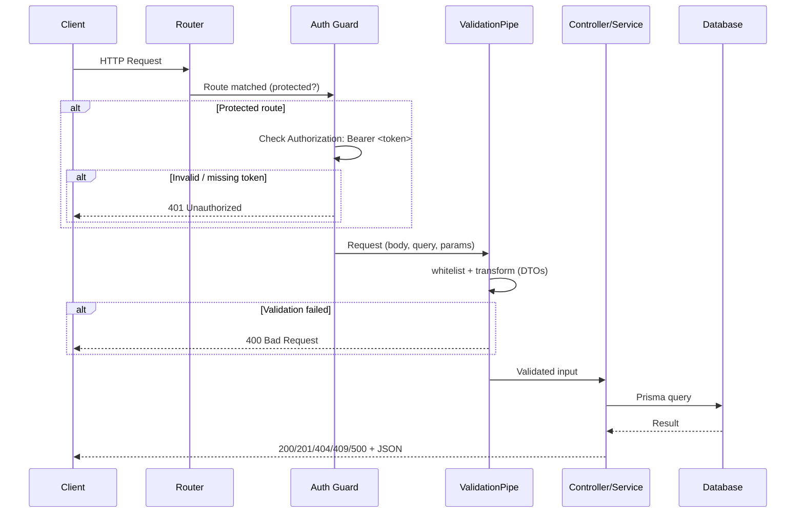

# Request Flow & Security

This document describes how an HTTP request is processed by the SpaceFlow API and which security measures apply.

---

## Request Flow Diagram

### Flow summary

| Step | Component | Responsibility |
|------|-----------|----------------|
| 1 | Nest router | Receives the request, matches route (e.g. `POST /reservations`). |
| 2 | `BearerAuthGuard` | On protected routes, validates `Authorization: Bearer <token>` against `AUTH_BEARER_TOKEN`. Returns 401 if missing or invalid. |
| 3 | `ValidationPipe` | Validates and transforms body/query/params using DTOs (class-validator). Strips unknown fields; invalid input → 400. |
| 4 | Controller + Service | Controller delegates to service; service uses Prisma for DB. Exceptions (e.g. `NotFoundException`, `ConflictException`) become 404, 409, 500. |
| 5 | Response | Nest serializes the return value to JSON and sends the appropriate HTTP status. |

---

## Security parameters and configuration

### 1. Authentication (Bearer token)

- **Mechanism**: API key–style Bearer token in the `Authorization` header.
- **Env variable**: `AUTH_BEARER_TOKEN` (required for protected routes).
- **Usage**: Send `Authorization: Bearer <AUTH_BEARER_TOKEN>` on every request to protected endpoints.
- **Protected routes**: All under `/places`, `/spaces`, `/reservations`, `/telemetry`, and `GET /protected`. Public: `GET /`, `GET /health`.

| Parameter | Description | Example / recommendation |
|-----------|-------------|---------------------------|
| `AUTH_BEARER_TOKEN` | Secret token; must match exactly. | Use a long, random value in production; never commit to git. |

### 2. Input validation and sanitization

- **Global ValidationPipe** (in `main.ts`):
  - **`whitelist: true`**: Removes any property not defined on the DTO (prevents mass assignment).
  - **`transform: true`**: Coerces types (e.g. query string `"10"` → number) according to DTO decorators.

| Parameter | Purpose |
|-----------|--------|
| `whitelist` | Only allow DTO-defined fields; ignore extra payload. |
| `transform` | Type coercion so validators receive the expected types. |

### 3. Environment and secrets

- **Do not commit** `.env` or any file containing real tokens or DB URLs.
- **Use** `.env.example` as a template only (no real secrets).

| Variable | Sensitivity | Notes |
|----------|-------------|--------|
| `AUTH_BEARER_TOKEN` | Secret | Required for protected endpoints; rotate in production. |
| `DATABASE_URL` | Secret | Contains DB credentials; use strong password. |
| `MQTT_BROKER_URL` | Config | Optional; internal or secured in production. |
| `PORT` | Config | Non-sensitive. |

### 4. Docker runtime security

- **User**: The API container runs as non-root user `nestjs` (UID 1001), reducing impact of container escape or path traversal.
- **Image**: Multi-stage build; final image has no dev dependencies or source, only runtime assets.

### 5. HTTP and transport (recommendations)

- **TLS**: In production, put the API behind a reverse proxy (e.g. Nginx, Traefik) or load balancer that terminates HTTPS. The diagram above does not change; only the transport is encrypted.
- **CORS**: Configure `app.enableCors(...)` in `main.ts` if the frontend is on another origin; restrict origins in production.

### 6. Error handling and information disclosure

- **Known errors**: 400, 401, 404, 409 return clear, client-safe messages (e.g. “Space already reserved in this time slot”).
- **Logging**: Internal errors are logged server-side (e.g. via `ErrorLoggerService`); stack traces are not sent to the client on 500.

---

## Quick reference: which routes require auth?

| Route prefix | Auth required |
|--------------|----------------|
| `GET /`, `GET /health` | No |
| `GET /protected` | Yes (Bearer) |
| `/places`, `/spaces`, `/reservations`, `/telemetry` | Yes (Bearer) |

All protected endpoints return **401 Unauthorized** when the `Authorization` header is missing or the token does not match `AUTH_BEARER_TOKEN`.
