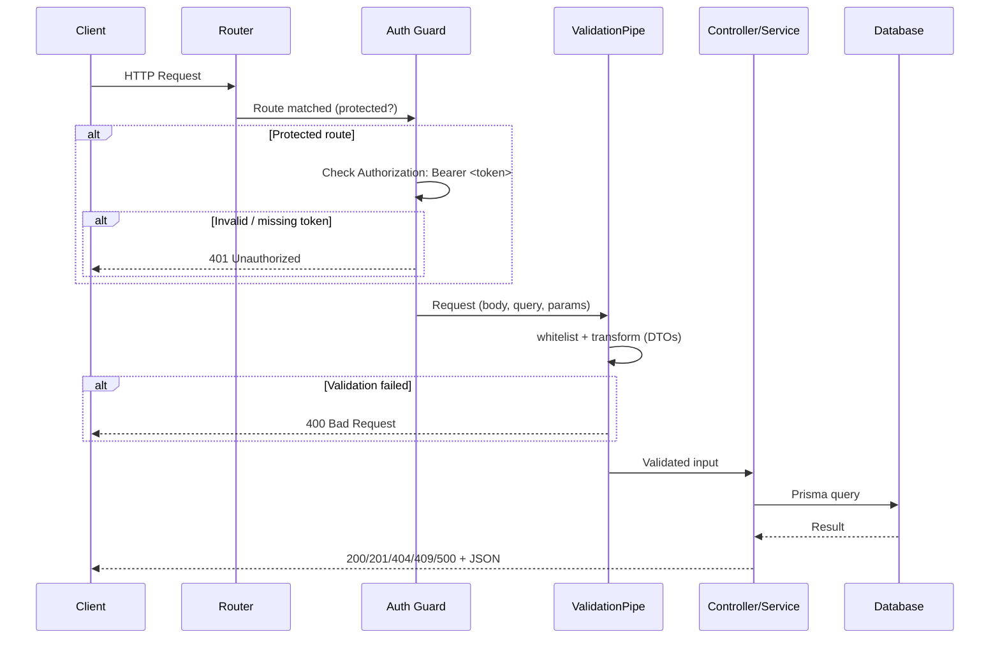

# Request Flow & Security

This document describes how an HTTP request is processed by the SpaceFlow API and which security measures apply.

---

## Request Flow Diagram

### Flow summary

| Step | Component | Responsibility |
|------|-----------|----------------|
| 1 | Nest router | Receives the request, matches route (e.g. `POST /reservations`). |
| 2 | `BearerAuthGuard` | On protected routes, validates `Authorization: Bearer <token>` against `AUTH_BEARER_TOKEN`. Returns 401 if missing or invalid. |
| 3 | `ValidationPipe` | Validates and transforms body/query/params using DTOs (class-validator). Strips unknown fields; invalid input → 400. |
| 4 | Controller + Service | Controller delegates to service; service uses Prisma for DB. Exceptions (e.g. `NotFoundException`, `ConflictException`) become 404, 409, 500. |
| 5 | Response | Nest serializes the return value to JSON and sends the appropriate HTTP status. |

---

## Security parameters and configuration

Summary of what the API already implements:

### 1. Authentication (Bearer token)

- **Bearer token** in `Authorization` header; secret comes from `AUTH_BEARER_TOKEN`.
- **Protected routes**: `/places`, `/spaces`, `/reservations`, `/telemetry`, `GET /protected`. **Public**: `GET /`, `GET /health`.
- Invalid or missing token → **401 Unauthorized**.

### 2. Input validation and sanitization

- **Global ValidationPipe** in `main.ts` with **`whitelist: true`** (strips properties not defined on DTOs) and **`transform: true`** (coerces query/params to the types declared in DTOs). Invalid input → **400 Bad Request**.

### 3. Environment and secrets

- Config is read from **`.env`** (not committed); **`.env.example`** documents variables: `AUTH_BEARER_TOKEN`, `DATABASE_URL`, `MQTT_BROKER_URL`, `PORT`.

### 4. Docker runtime

- API container runs as **non-root** user `nestjs` (UID 1001). Image is **multi-stage**: final image has only production deps and compiled output, no dev tools or source.

### 5. Error handling and logging

- **4xx/5xx**: 400, 401, 404, 409 return clear, client-safe messages (e.g. “Space already reserved in this time slot”). **Server errors**: logged via `ErrorLoggerService`; stack traces are not returned in the response body.

---

## Quick reference: which routes require auth?

| Route prefix | Auth required |
|--------------|----------------|
| `GET /`, `GET /health` | No |
| `GET /protected` | Yes (Bearer) |
| `/places`, `/spaces`, `/reservations`, `/telemetry` | Yes (Bearer) |

All protected endpoints return **401 Unauthorized** when the `Authorization` header is missing or the token does not match `AUTH_BEARER_TOKEN`.
